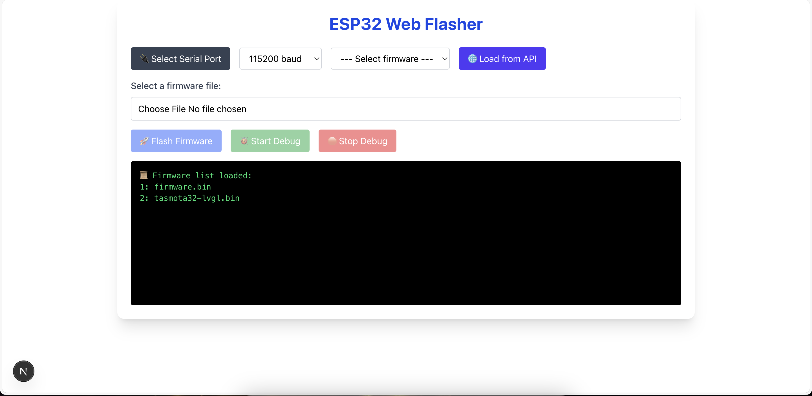

# ESP32 Web Flasher 📲

A modern, browser-based ESP32 firmware flasher and serial debug viewer built with **Next.js 15**, **TypeScript**, and **Tailwind CSS**, using the `esptool-js` library and **Web Serial API**.



---

## 🚀 Features

- Flash `.bin` firmware files to ESP32 over USB
- Select serial port and baud rate (up to 921600)
- Start/stop real-time serial debug monitor
- Works on **Chrome**, **Edge**, or any browser supporting Web Serial API
- Responsive, styled with Tailwind CSS

---

## 🧑‍💻 Requirements

- Google Chrome or Microsoft Edge (Version 89+)
- ESP32 in bootloader mode (press and hold BOOT button when connecting)
- `.bin` firmware file generated with ESP-IDF or Arduino

---

## 📦 Getting Started

### 1. Clone and install dependencies:

```bash
git clone https://github.com/yourusername/esp32-webflasher-nextjs.git
cd esp32-webflasher-nextjs
npm install
```

### 2. Run locally:

```bash
npm run dev
```

Then open: [http://localhost:3000](http://localhost:3000/)

---

## 🧠 How It Works

- Uses [`esptool-js`](https://github.com/espressif/esptool-js) to communicate with ESP32 bootloader via USB
- Uses `navigator.serial` to access serial ports (Web Serial API)
- Reads `.bin` file, syncs with ESP32, erases flash, writes data

---

## 🛠 Developer Notes

- No native drivers required, works in-browser
- No ELF → BIN conversion (must upload precompiled `.bin` file)
- Tested with ESP32 DevKit v1 and NodeMCU boards

---

## 🔐 Permissions

The browser will prompt for permission to access USB serial ports. Ensure you select the correct one (typically `CP210x` or `CH340`).

---

## 📜 License

This project is open source under the [MIT License](https://www.notion.so/LICENSE).

---

## 🙏 Credits

- [esptool-js](https://github.com/espressif/esptool-js) by Espressif
- [Next.js](https://nextjs.org/)
- [Tailwind CSS](https://tailwindcss.com/)